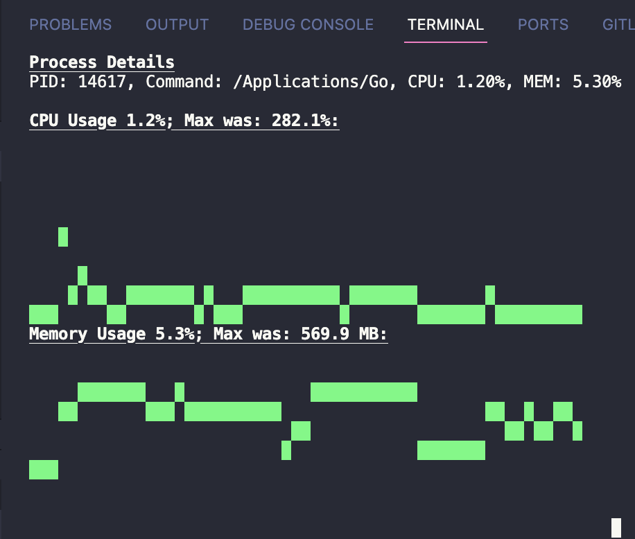
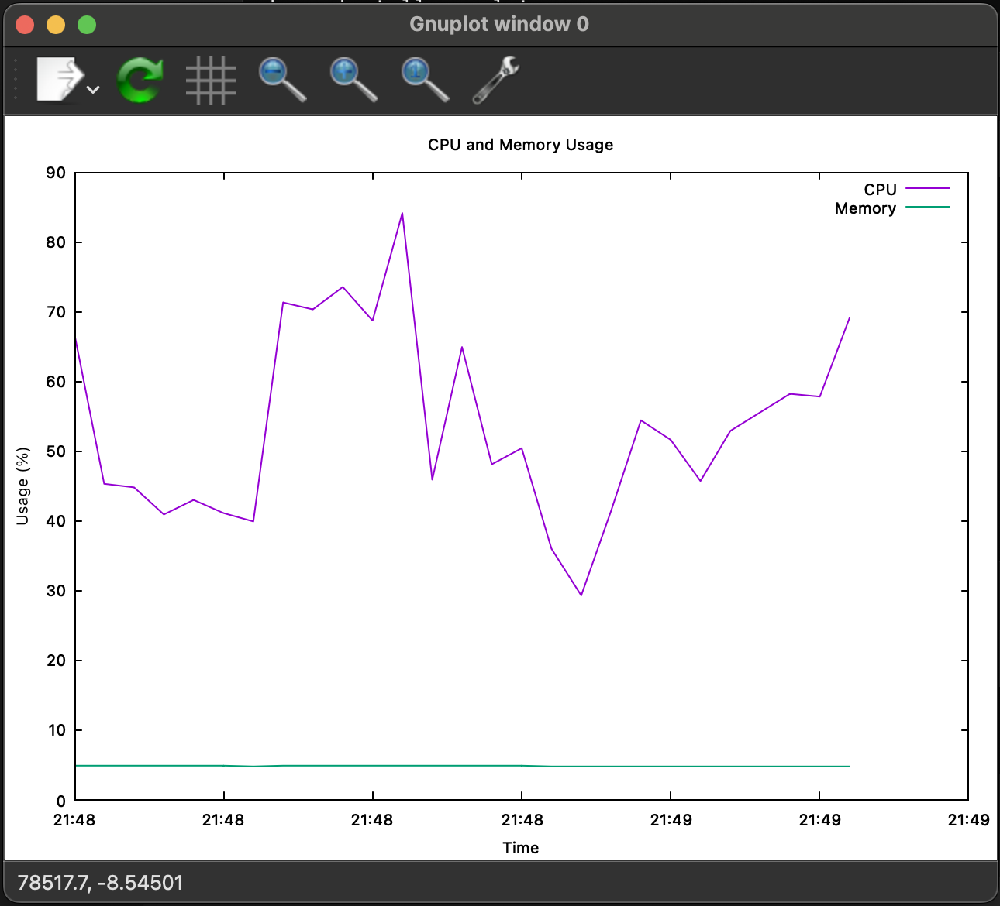

# Native process monitoring tool

## Features

**Real-Time Monitoring:**

Updates every second with the latest CPU and memory stats.

**Dynamic Terminal Charts:**

Displays live line charts for CPU and memory usage naively in the terminal.

**Process Details:**

Lists PID, command, CPU, and memory usage for the monitored process.

## Usage

It will ask for PID or process name after the start command.

```sh
npm install
npm run start
```

### Tip
It's worth fine-tuning the `renderAsciiLineChart` method's third parameter, so you can see something on the charts.

### Result


## Alternativ options

### Record data
```bash
echo "Time,CPU,MEM" > usage_data.csv
while true; do
    stats=$(ps -p <PID> -o %cpu,%mem | tail -1)
    echo "$(date +%H:%M:%S),$stats" >> usage_data.csv
    sleep 1
done
```

### Install gnuplot

```bash
brew install gnuplot
```

### Displaying

create `plot.gnu` file
```bash
set datafile separator ","
set title "CPU and Memory Usage"
set xlabel "Time"
set ylabel "Usage (%)"
set xdata time
set timefmt "%H:%M:%S"
set format x "%H:%M"
plot "usage_data.csv" using 1:2 title "CPU" with lines, \
     "usage_data.csv" using 1:3 title "Memory" with lines
```

and run it
```bash
gnuplot -p plot.gnu
```

### Result
